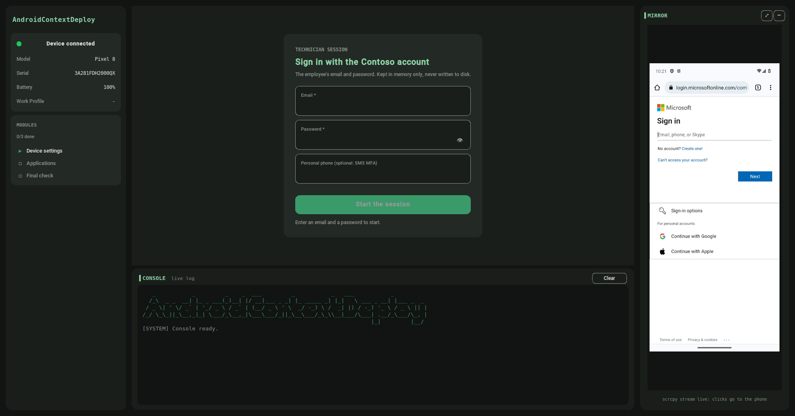
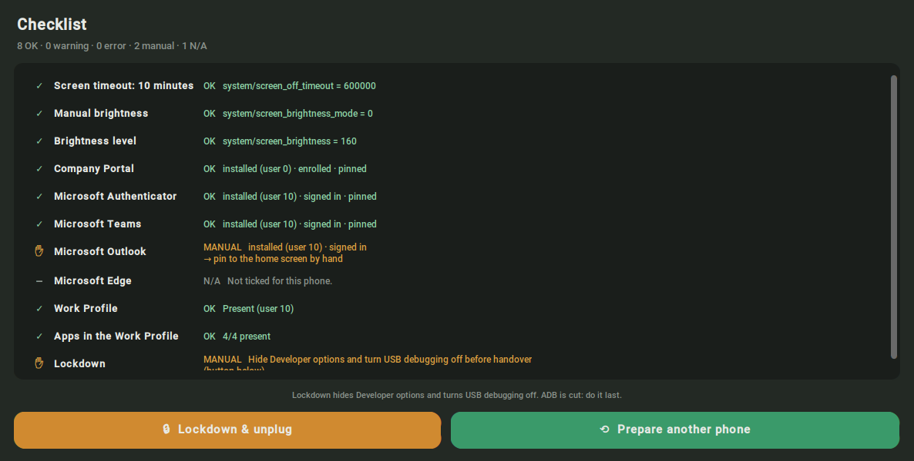

```
   _           _         _    _  ___         _           _   ___           _
  /_\  _ _  __| |_ _ ___(_)__| |/ __|___ _ _| |_ _____ _| |_|   \ ___ _ __| |___ _  _
 / _ \| ' \/ _` | '_/ _ \ / _` | (__/ _ \ ' \  _/ -_) \ /  _| |) / -_) '_ \ / _ \ || |
/_/ \_\_||_\__,_|_| \___/_\__,_|\___\___/_||_\__\___/_\_\\__|___/\___| .__/_\___/\_, |
                                                                     |_|         |__/
```

<div align="center">

# AndroidContextDeploy

**Phone preparation, Intune enrollment and quick device diagnostics for Android**

[](https://github.com/DireDoch/AndroidContextDeploy/actions/workflows/tests.yml)
[](docs/manual.pdf)
[](LICENSE)

</div>

---

<p align="center">
  
</p>

## Where this comes from

This is a spin-off of a tool I wrote on the job as an IT technician, where
company phones were handed to employees week after week — each one needing the
same Intune enrollment, the same Microsoft apps, the same sign-ins, and the same
settings nobody remembers to change until the battery is flat by noon.

None of it is hard. All of it is slow: a phone is fifteen screens of Company
Portal enrollment, four apps to find in the managed Play Store, four sign-ins with
an address typed on a tiny keyboard, an SMS code that arrives on somebody else's
phone, and icons to drag to the home screen. Miss one and nobody finds out until
the employee calls.

The tool never took the technician out of the loop — Android does not allow it,
and MFA should not. What it changed is that the phone sits on the desk plugged
into a computer, mirrored in a window, while the tool types the credentials,
taps through the screens it knows, waits patiently on the ones it must not
touch, and finishes with a **checklist of what was done and what is still left
by hand**.

AndroidContextDeploy is that idea, rebuilt in the open: the company-specific
parts moved out into a manifest you edit, the screens it recognises covered by
tests replayed from real captures, and the whole thing documented well enough
that somebody who has never touched ADB can extend it.

> 📖 **[Read the manual (PDF)](docs/manual.pdf)** — what the tool does, what it
> leaves to you, how the pieces fit together, and how to extend it.
> Source in [`docs/manual.typ`](docs/manual.typ), built with
> [Typst](https://typst.app/).

## What it does

A technician plugs a phone in with USB debugging on, types the employee's email
and password, and runs three **Modules** in order:

| Module | What it does |
|---|---|
| **Device settings** | Applies every Android setting listed in `deploy.json` (screen timeout, brightness…) and reads each one back from the phone. |
| **Applications** | Enrolls the phone with the **Company Portal** (which creates the Work Profile), then brings each ticked app from the managed Play Store, signs it in and pins it to the home screen. |
| **Final check** | Confirms the Work Profile and the apps are there, and shows the **Checklist**. |

While it works, the phone is **mirrored live** in the window, and the Mirror is
**touch-enabled**: a click is a tap and a drag is a swipe, landing on the exact
point under the mouse pointer whatever the window size or display scaling. Every
Manual Action can be done from the computer, without picking the phone up. Only
touches are sent — type with the phone's on-screen keyboard. Nothing is installed
on the phone.

> [!WARNING]
> The tool drives a phone with an employee's credentials. Read
> [SECURITY.md](SECURITY.md) and `deploy.json` before the first real phone.

### What stays with you

ADB is powerful, not almighty, and some steps belong to a human on purpose:

- **Opening a Work Profile app.** Android Enterprise refuses to let ADB launch it.
  The tool shows *ACTION REQUIRED — open Microsoft Teams*; you tap the icon in the
  Mirror, and from the sign-in screen on, it types the email and password itself.
- **MFA.** Approving a sign-in or typing an SMS code is the employee's. The tool
  waits — Enrollment waits forever, by design, until the managed Play Store shows.
- **Values with accents.** `adb` types ASCII only. An email, password or phone
  number with accents is never sent: the tool asks you to type it in the Mirror,
  and the Checklist notes it.
- **Lockdown.** Turning USB debugging off is irreversible at the desk, so it is a
  button you press, never a step that runs.

### The Checklist at the end

Every Result from every Module, in the order it ran, with the fix when something
needs one:



`OK`, `WARNING` and `ERROR` speak for themselves. `MANUAL` is yours to do;
`N/A` does not apply to this phone, so its absence is correct rather than a
problem.

## Installation and launch

### What you need

- **A computer:** Windows 10/11, or a 64-bit Linux desktop (X11 or Wayland).
- **The phone:** Android and a USB cable that carries **data** (a charge-only
  cable shows nothing).
- **For Enrollment:** a Microsoft Intune tenant, with the apps assigned to the
  employee.

### Prepare the phone (once per phone)

1. *Settings → About phone → Software information*: tap **Build number** seven
   times. Developer options appear.
2. *Settings → Developer options*: turn on **USB debugging**.
3. Plug the cable in and tap **Allow** on the phone (tick *Always allow from this
   computer*).

### Windows

1. Download `AndroidContextDeploy-vX.Y.Z-windows.zip` from
   [Releases](https://github.com/DireDoch/AndroidContextDeploy/releases).
2. Right-click it → **Extract all**. Do not run it from inside the zip.
3. Double-click `AndroidContextDeploy.exe`. If SmartScreen warns about an
   unsigned app: *More info → Run anyway*.

adb ships inside. If the phone never appears, install its manufacturer's USB
driver (Samsung, Google…).

### Linux

1. Download `AndroidContextDeploy-vX.Y.Z-linux.tar.gz` from
   [Releases](https://github.com/DireDoch/AndroidContextDeploy/releases), then:

   ```bash
   tar -xzf AndroidContextDeploy-v*-linux.tar.gz
   cd AndroidContextDeploy
   ./AndroidContextDeploy
   ```

2. **Let your user reach the phone over USB.** adb ships inside, but without
   *udev rules* Linux reports the phone as `no permissions` and the device card
   never turns green. Install the rules once, then unplug and plug the phone back:

   | Distribution | Command |
   |---|---|
   | Debian, Ubuntu, Mint | `sudo apt install android-sdk-platform-tools-common`, then `sudo usermod -aG plugdev $USER` and log out and back in |
   | Fedora | `sudo dnf install android-tools` |
   | Arch, Manjaro, CachyOS | `sudo pacman -S android-udev` |

The Linux release is built on Ubuntu 24.04 and needs glibc 2.39 or newer
(Ubuntu 24.04, Debian 13, Fedora 40 and later); on an older system, run it from
source. Under Wayland it runs through XWayland, like any Tk application.

### From source (development, or an older Linux)

Python 3.11+ **with Tk**:

| System | Install |
|---|---|
| Windows | The [python.org](https://www.python.org/downloads/) installer (Tk included) |
| Debian, Ubuntu | `sudo apt install python3 python3-venv python3-tk` |
| Fedora | `sudo dnf install python3 python3-tkinter` |
| Arch | `sudo pacman -S python tk` |

```bash
git clone https://github.com/DireDoch/AndroidContextDeploy.git
cd AndroidContextDeploy
python3 -m venv .venv
source .venv/bin/activate      # fish: .venv/bin/activate.fish · Windows: .venv\Scripts\activate
pip install -r requirements.txt -e .
python main.py                 # or: androidcontextdeploy
```

`requirements.txt` pins the exact versions CI and the release use; `-e .`
installs the tool itself from the clone. On Linux the udev step above applies
here too.

### Options

| Option | Effect |
|---|---|
| *(none)* | Normal run. Nothing is written to disk. |
| `--lang fr` | Force the UI Language (`en`, `fr`, or any file in `locales/`). Defaults to `deploy.json`, then the system locale. |
| `--diag` | Capture every screen (XML + PNG) and every adb command to `diag/`, password and phone number masked. For teaching the tool a new screen. |

`adb` is looked up in this order: the `ADB_COMMAND` environment variable,
`platform-tools/` next to the tool, `adb` on your `PATH`, then the copy bundled
with the `adbutils` package.

## Configuration

Everything company-specific lives in `deploy.json`, next to the executable.
Editing it never needs a rebuild.

```json
{
  "organization": "Example Corp",
  "language": "auto",
  "device_settings": [
    { "name": "Screen timeout: 10 minutes", "namespace": "system",
      "key": "screen_off_timeout", "value": "600000" }
  ],
  "catalog": [
    { "name": "Company Portal", "package_id": "com.microsoft.windowsintune.companyportal",
      "enrollment": true, "sign_in": true, "pin": true },
    { "name": "Microsoft Teams", "package_id": "com.microsoft.teams",
      "sign_in": true, "pin": true },
    { "name": "Microsoft Edge", "package_id": "com.microsoft.emmx", "selected": false }
  ]
}
```

| Key | Meaning |
|---|---|
| `organization` | Your company as its name appears on the phone's ownership screen ("*Example Corp* device"). Enrollment taps that option, never "Personal". |
| `language` | UI Language: `auto`, `en`, `fr`… |
| `device_settings[]` | `name` shown to the technician, and an Android `settings put <namespace> <key> <value>`. `namespace` is `system`, `secure` or `global`. |
| `catalog[]` | The apps, in the order they are set up. `package_id` is the Play Store id. |
| `catalog[].enrollment` | The Company Portal. At most one, and it must come first. |
| `catalog[].sign_in` | Run the Detection Loop and type the credentials. |
| `catalog[].pin` | Put a shortcut on the home screen. |
| `catalog[].selected` | Ticked by default (default `true`). |
| `catalog[].activity` | Launcher activity (`package/.Activity`), used only when the phone cannot resolve it. Optional. |

A mistake in the file is reported on start with the key to fix, before anything
touches a phone.

## Branding

The startup banner is read from `banner.txt`. To use your own, generate ASCII
art at [patorjk.com/software/taag](https://patorjk.com/software/taag/) and paste
it in. Delete the file and the plain name is shown instead.

## Languages

There are two different languages, and they are not the same thing:

- **UI Language** — what the technician reads. English and French ship; adding
  one is copying `locales/en.json` to `locales/<code>.json` and translating the
  values. No code, no rebuild.
- **Phone Language** — what the phone's own screens are in. The detector
  recognises **English and French** screens. Another language needs keywords
  proven by real captured screens: see [CONTRIBUTING.md](CONTRIBUTING.md).

## Tests

```bash
pip install -r requirements-dev.txt -e .
ruff check .                     # lint
mypy                             # types
python -m pytest --cov           # tests and coverage
```

No phone needed: adb is faked and every screen is a recorded, masked XML dump.
`tests/test_gui.py` opens the real window with a fake phone — including a check
that a click on the Mirror touches the stream pixel under the pointer — and is
skipped without a display.

Every push and pull request runs ruff, mypy and the suite on Ubuntu and Windows.
On Ubuntu the window tests run under Xvfb and coverage must stay at 80 % or more.
CI also compiles `docs/manual.typ`, so the manual cannot rot while nobody rebuilds
it.

## Building

```bash
pip install -r requirements-dev.txt
python build.py 1.0.0
```

Produces `dist/AndroidContextDeploy/` and an archive. Pushing a `v*` tag builds
both the Windows and the Linux bundle on GitHub Actions and publishes them with
`SHA256SUMS.txt` and a build provenance attestation. To check that a download
came, untouched, from this repository's workflow:

```bash
sha256sum -c SHA256SUMS.txt --ignore-missing
gh attestation verify AndroidContextDeploy-v1.0.0-linux.tar.gz -R DireDoch/AndroidContextDeploy
```

## Structure

```
deploy.json                      <- apps, settings, organization (edit this)
banner.txt                       <- startup banner (editable)
locales/                         <- UI Languages: en.json, fr.json
main.py                          <- entry point (--diag, --lang)
pyproject.toml                   <- package, ruff, mypy and pytest settings
requirements.txt                 <- exact runtime versions (-dev: plus the tools)
build.py                         <- PyInstaller bundle
scrcpy_server/                   <- scrcpy-server jar for the Mirror (Apache-2.0)
src/androidcontextdeploy/
  app.py                         <- the window: Session, queues, wiring
  runner.py                      <- runs a Module off the UI thread, keeps Results
  modules/                       <- device_settings, applications, final_check
  adb.py                         <- the only place that runs adb
  detection.py                   <- reads a screen dump (pure parsing)
  signin.py                      <- the Detection Loop and Enrollment
  mirror_service.py              <- the scrcpy client
  diagnostics.py                 <- --diag capture, masked
  manifest.py / i18n.py / models.py
  ui/                            <- passive CustomTkinter panels
tests/                           <- pytest, no phone needed
docs/
  manual.typ / manual.pdf        <- the manual
  adr/                           <- why things are the way they are
```

## Documentation

- **[The manual (PDF)](docs/manual.pdf)** — what the tool does, what it leaves to
  you, the architecture in diagrams, ADB and the other technologies explained
  simply, Enrollment in depth, how to extend it, and troubleshooting.
  Rebuild it with `typst compile docs/manual.typ`.
- **[docs/adr/](docs/adr/)** — the decisions a newcomer would otherwise try to
  "fix": no app on the phone, no timeout on Enrollment, no OCR.
- **[CONTEXT.md](CONTEXT.md)** — the vocabulary: Module, Result, Work Profile,
  Enrollment, Manual Action…

## Contributing

**Ideas are genuinely welcome, and they do not have to come with code.**

This started as one technician's tool for one fleet, so the parts that felt
obvious to me may well be wrong for you. If your phones need something mine
never did, that is worth an issue — even if it is only a sentence describing
what you do by hand today.

Always useful: a step you still do by hand, a screen the tool does not recognise
(run with `--diag` and attach the masked XML), a Phone Language or UI Language, a
place where the Checklist told you nothing useful, or a plain bug report.

No contribution is too small, and "I tried this and it did not work" is a
perfectly good contribution.

See **[CONTRIBUTING.md](CONTRIBUTING.md)** for how to set up, what a change
should come with, and the house style — plus [SECURITY.md](SECURITY.md) if you
have found something that should not be reported in public.

## License

MIT — see [LICENSE](LICENSE). Do what you like with it.
`scrcpy_server/scrcpy-server-v3.3.4.jar` is from
[scrcpy](https://github.com/Genymobile/scrcpy), Apache-2.0 — see
[scrcpy_server/LICENSE](scrcpy_server/LICENSE).
